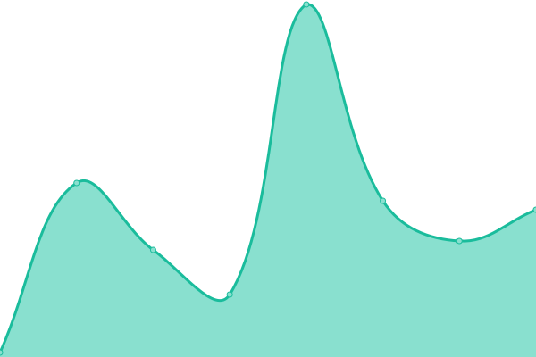
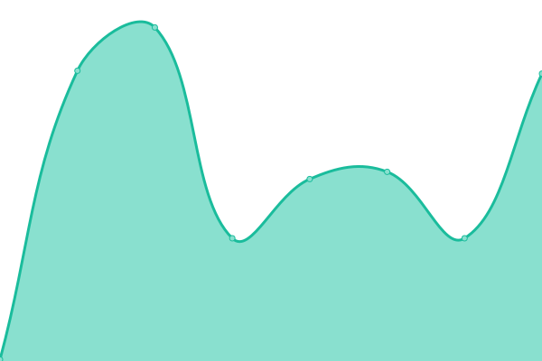

# [📈 Live Status](https://omawhite.github.io/Omars-portfolio-uptime-monitor): <!--live status--> **🟧 Partial outage**

This repository contains the open-source uptime monitor and status page for [Omar Louis White](https://www.louiswhite.me/), powered by [Upptime](https://github.com/upptime/upptime).

With [Upptime](https://upptime.js.org), you can get your own unlimited and free uptime monitor and status page, powered entirely by a GitHub repository. We use [Issues](https://github.com/omawhite/Omars-portfolio-uptime-monitor/issues) as incident reports, [Actions](https://github.com/omawhite/Omars-portfolio-uptime-monitor/actions) as uptime monitors, and [Pages](https://omawhite.github.io/Omars-portfolio-uptime-monitor) for the status page.

<!--start: status pages-->
<!-- This summary is generated by Upptime (https://github.com/upptime/upptime) -->
<!-- Do not edit this manually, your changes will be overwritten -->
<!-- prettier-ignore -->
| URL | Status | History | Response Time | Uptime |
| --- | ------ | ------- | ------------- | ------ |
|  [louiswhite.me](https://louiswhite.me) | 🟩 Up | [louiswhite-me.yml](https://github.com/omawhite/portfolio-uptime-monitor/commits/HEAD/history/louiswhite-me.yml) | 

 407ms
     
 | 

<a href="https://upptime.louiswhite.me/history/louiswhite-me">100.00%</a>
    

|  [www.louiswhite.me](https://www.louiswhite.me) | 🟩 Up | [www-louiswhite-me.yml](https://github.com/omawhite/portfolio-uptime-monitor/commits/HEAD/history/www-louiswhite-me.yml) | 

 22ms
     
 | 

<a href="https://upptime.louiswhite.me/history/www-louiswhite-me">100.00%</a>
    

|  [netlify url](https://omars-next-portfolio.netlify.app) | 🟥 Down | [netlify-url.yml](https://github.com/omawhite/portfolio-uptime-monitor/commits/HEAD/history/netlify-url.yml) | 

 110ms
     
 | 

<a href="https://upptime.louiswhite.me/history/netlify-url">0.00%</a>
    

<!--end: status pages-->

[**Visit our status website →**](https://omawhite.github.io/Omars-portfolio-uptime-monitor)

## 📄 License

- Powered by: [Upptime](https://github.com/upptime/upptime)
- Code: [MIT](./LICENSE) © [Omar Louis White](https://www.louiswhite.me/)
- Data in the `./history` directory: [Open Database License](https://opendatacommons.org/licenses/odbl/1-0/)
